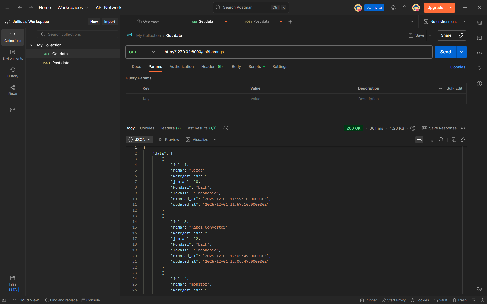
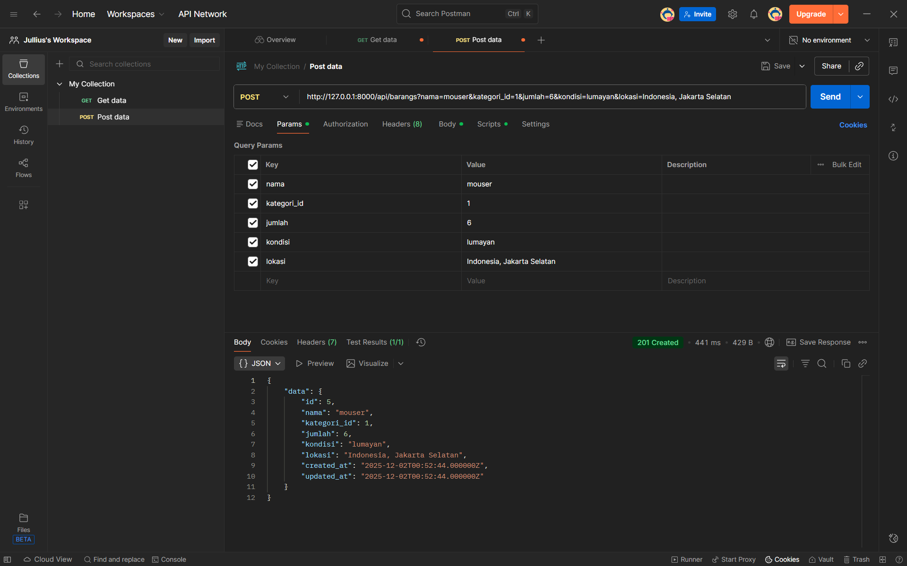

# Aplikasi Inventory Management

Selamat datang di Aplikasi Inventory Management — sebuah aplikasi berbasis Laravel untuk
mengelola barang, kategori, peminjaman, user, dan roles/permissions.

Catatan: Bahasa UI di dalam aplikasi ini menggunakan Bahasa Indonesia.

---

## Fitur Utama ✅
- Manajemen barang (CRUD: buat, baca, update, hapus)
- Manajemen kategori (CRUD)
- Manajemen peminjaman barang (pinjam/kembali)
- Manajemen user dan role (Spatie Permissions)
- Otentikasi standar Laravel (login/register)
- Seed user & role default untuk pengujian

## Teknologi & Dependensi 🔧
- PHP ^8.2
- Laravel ^11.x
- Spatie Laravel Permission
- Laravel Sanctum/Orion
- Tailwind CSS, Bootstrap, Vite
- Postman untuk testing

## Persyaratan Sistem 📋
- PHP 8.2+
- Composer
- Node.js & npm
- Database: MySQL (direkomendasikan) atau SQLite/PostgreSQL

## Setup & Instalasi (Windows - PowerShell) 🛠️
1. Clone repository:

```powershell
git clone <repo-url>
cd muhammadaliirfansyah_inventory
```

2. Install dependency PHP dan Node:

```powershell
composer install
npm install
```

3. Salin file environment dan konfigurasi dasar (`.env`):

```powershell
Copy-Item .env.example .env
```

4. Konfigurasi MySQL (direkomendasikan)

Pastikan MySQL berjalan di sistem Anda atau gunakan Docker/Postgres jika diinginkan. Buat database MySQL baru untuk aplikasi ini. Contoh perintah MySQL:

```powershell
# PowerShell-safe: gunakan single quotes around SQL statement
mysql -u root -p -e 'CREATE DATABASE inventory CHARACTER SET utf8mb4 COLLATE utf8mb4_unicode_ci;'
```
Atau gunakan Docker untuk menjalankan MySQL cepat (contoh):

```powershell
docker run --name mysql-local -e MYSQL_ROOT_PASSWORD=secret -e MYSQL_DATABASE=inventory -e MYSQL_USER=appuser -e MYSQL_PASSWORD=apppassword -p 3306:3306 -d mysql:8.0
```

Jika Anda memakai Docker, sesuaikan `.env` dengan credential yang dipakai di atas:

```env
DB_CONNECTION=mysql
DB_HOST=127.0.0.1
DB_PORT=3306
DB_DATABASE=inventory
DB_USERNAME=appuser
DB_PASSWORD=apppassword
```

Jika Local isi file `.env` atau edit nilai DB untuk menghubungkan ke MySQL:

```env
DB_CONNECTION=mysql
DB_HOST=127.0.0.1
DB_PORT=3306
DB_DATABASE=inventory
DB_USERNAME=root
DB_PASSWORD=secret
```

---

## Troubleshooting & Tips ⚠️
- Jika migrasi `php artisan migrate` error, periksa credential MySQL di `.env` dan pastikan database sudah dibuat (lihat langkah 4).
- Untuk menghapus semua tabel dan memulai ulang (development only):

```powershell
php artisan migrate:fresh --seed
```

- Jika gagal saat seeding roles/permissions, pastikan package Spatie Permission telah dipublish dan migration tabel role/permission selesai tanpa error:

```powershell
php artisan vendor:publish --provider="Spatie\Permission\PermissionServiceProvider" --tag="migrations"
php artisan migrate
php artisan db:seed --class=PermissionSeeder
```

- Jika Anda menggunakan Docker untuk MySQL, pastikan container berjalan dan port 3306 tidak diblokir atau digunakan oleh aplikasi lain.


> Jika Anda sering membuat DB secara lokal, Anda bisa menggunakan MySQL Workbench, phpMyAdmin, atau Docker container untuk membuat database.


5. Generate application key & migrasi database:

```powershell
php artisan key:generate
# Pastikan konfigurasi .env (DB_* values) sudah sesuai untuk MySQL
php artisan migrate --seed
```

6. Jalankan server development:

```powershell
php artisan serve
# atau jalankan script dev pada package composer
composer run dev
```

7. Jalankan Vite dev server (dibutuhkan jika tidak menggunakan `composer dev`):

```powershell
npm run dev
```

App sekarang seharusnya bisa diakses di: http://127.0.0.1:8000

---

## Akun Default untuk Testing 🔑
Dimasukkan oleh seeders pada `Database\Seeders` — gunakan akun berikut untuk login:

- Super Admin: super@gmail.com / Super12345
- Admin: admin@gmail.com / Admin12345
- Petugas: pm@gmail.com / User12345
- User: user@gmail.com / User12345

Catatan: Segera ubah password pada environment produksi.

---

## Struktur Folder & Resource Endpoints 🗂️
- Resource controllers dan route resource tersedia untuk:
	- /barangs (BarangController)
	- /kategoris (KategoriController)
	- /peminjamans (PeminjamanController)
	- /user (UserController)
	- /roles (RoleController)

Semua resource menggunakan controller resource (index/create/store/show/edit/update/destroy) dengan middleware `auth` dan `permission` Spatie untuk akses berbasis peran.

## Testing ✅
Jalankan unit/integration tests:

```powershell
php artisan test
# atau
vendor\bin\phpunit
```

---

## Tambahan Testing (Postman) 🧪
Berikut contoh tangkapan layar (screenshots) hasil request Postman yang menunjukkan endpoint GET dan POST bekerja sesuai ekspektasi.

**GET Request (Contoh):**


**POST Request (Contoh):**


Jika Anda ingin, saya dapat menambahkan contoh koleksi Postman atau file exported `.json` untuk reproducibility.

## Deployment & Production Tips 🚀
- Jalankan `npm run build` sebelum deploy untuk mengumpulkan assets Vite:

```powershell
npm run build
```
- Pastikan environment variables `.env` sudah berisi konfigurasi DB dan APP_URL.
- Gunakan queue worker pada environment production jika kamu menggunakan antrian:

```powershell
php artisan queue:work --tries=3
```

## Contributing & Code Style ✨
- Gunakan PSR-12 / `laravel/pint` untuk style:

```powershell
composer exec -- laravel/pint
```
- Berkontribusi melalui pull requests; buka issue untuk fitur/perbaikan.

## Lisensi 📜
Proyek ini dilisensikan di bawah MIT License (lihat `composer.json`).

---

Jika Anda ingin dokumentasi tambahan (API docs, deployment script, Docker), beri tahu saya dan saya akan menambahkannya. 👍

Terima kasih! 🙏